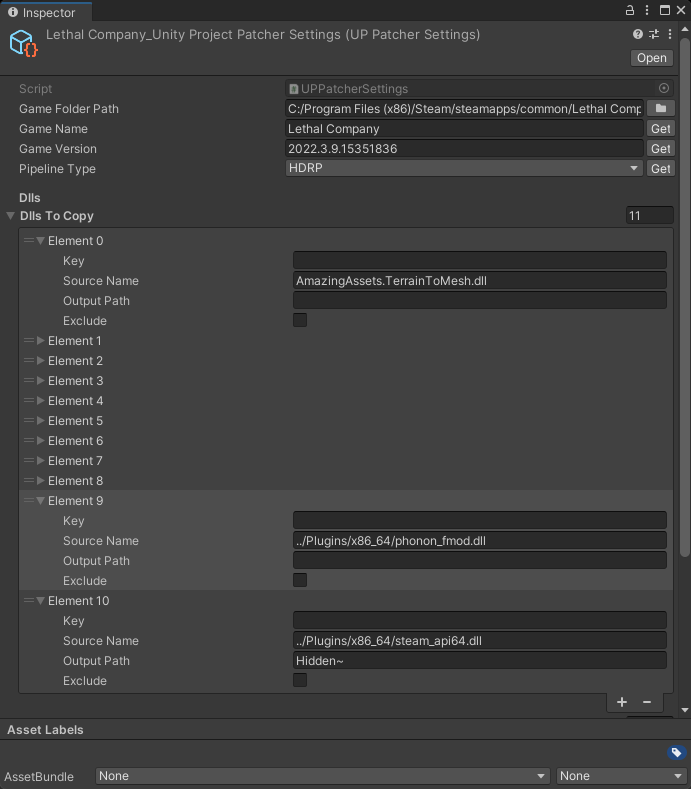
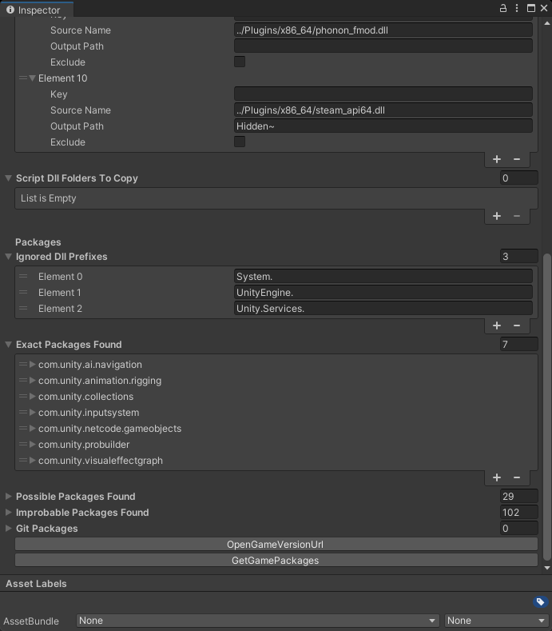
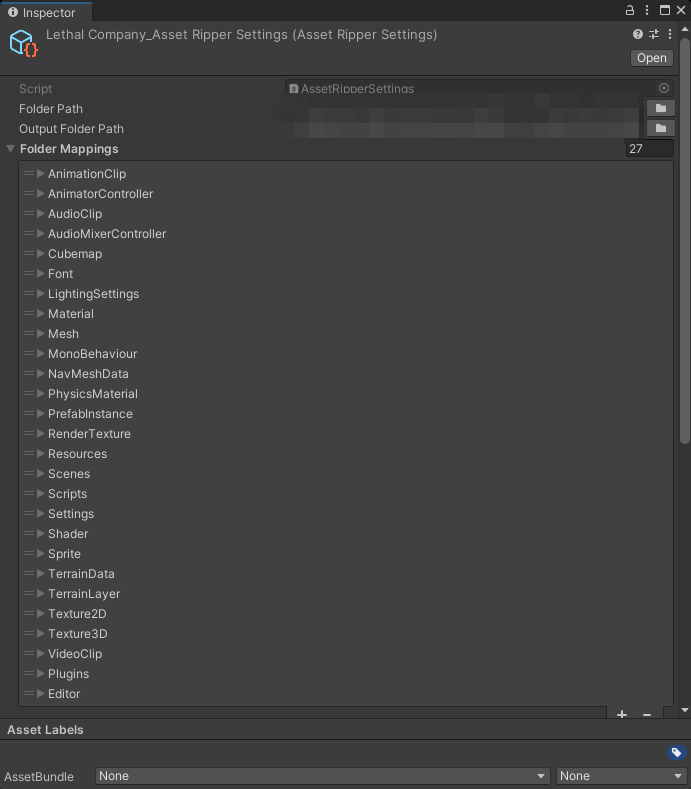
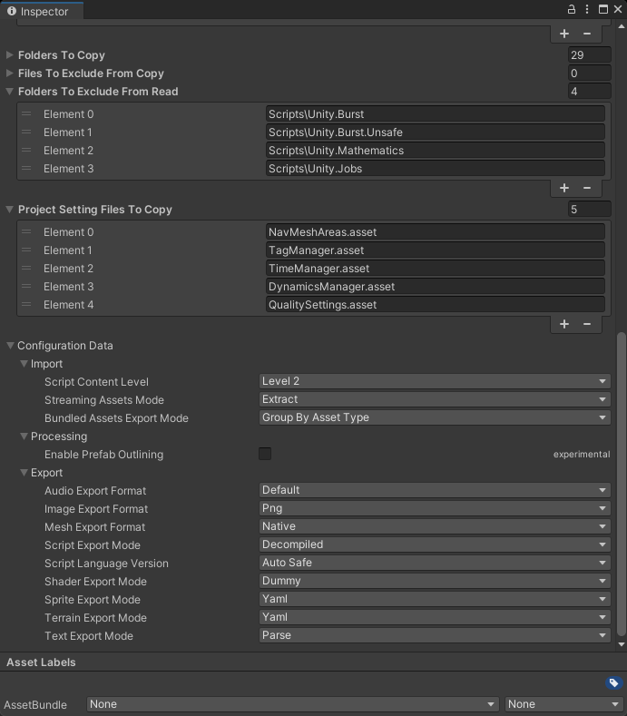

<div align="center">
  <h1>Unity Project Patcher</h1>

  <p>
    A tool that generates a Unity project from a game build that can be playable in-editor
  </p>
</div>

<div align="center">
<!-- Badges -->

<span></span>
<a href="https://github.com/nomnomab/unity-project-patcher/issues/">Report Bug</a>
<span> · </span>
<a href="https://github.com/nomnomab/unity-project-patcher/issues/">Request Feature</a>
</h4>

</div>

<br />

<!-- Table of Contents -->
# Table of Contents

- [About the Project](#about-the-project)
    * [Features](#features)
- [Getting Started](#getting-started)
    * [Prerequisites](#prerequisites)
    * [Installation](#installation)
- [Usage](#usage)
- [Custom Game Wrapper](#custom-game-wrapper)
- [FAQ](#faq)
- [Games I Tested With](#games-i-tested-with)

<!-- About the Project -->
## About the Project
This tool takes a unity game, extracts its assets/scripts/etc, and then generates a project for usage in the Unity editor.

> [!IMPORTANT]  
> Only supports Mono games at the moment!
>
> This tool does not distribute game files. It simply works off of your copy of the game!
>
> Also, this tool is for **personal** use only. Do not re-distrubute game files to others.

This core tool *doesn't* patch any game by itself itself, as it's just a core utility. Game wrappers have to utilize this core
to set up its pipeline, and any specific fixing for that specific game.

> [!NOTE]  
> I will *not* be taking requests for game wrappers to make 👍

<!-- Features -->
## Features

- Custom tool window content
- Auto-detected game wrappers for tool window usage
- A rough package detector
- A unity version detector
- A unity SRP pipeline detector
- Configurable Asset Ripper settings in the editor via a ScriptableObject
- Basic folder mappings
- Many provided patcher steps for common use-cases
- Script decompilation via Asset Ripper
- NGO code gen removal
- Much more

<!-- Getting Started -->
## Getting Started

### Already Bundled

This project is bundled with the following packages:

- [Editor Attributes](https://github.com/v0lt13/EditorAttributes)
    - Is excluded before 2020.3
- [UniTask](https://github.com/Cysharp/UniTask)
- [Quickenshtein](https://github.com/Turnerj/Quickenshtein)
- [SharpZipLib](https://github.com/icsharpcode/SharpZipLib)
    - This is for older Unity versions
    - Is excluded after 2020.3
- [ffmpeg](https://github.com/FFmpeg/FFmpeg/commit/cf4af4bca0)
    - This uses version `2024-04-29-git-cf4af4bca0-essentials_build-www.gyan.dev` from
      https://www.gyan.dev/ffmpeg/builds/, which is available under the terms
      of [GPL v3](https://github.com/FFmpeg/FFmpeg?tab=GPL-3.0-3-ov-file).

### Gets Downloaded

This project downloads a slightly tweaked version of [Asset Ripper](https://github.com/AssetRipper/AssetRipper), and is
downloded from the releases of my fork [here](https://github.com/nomnomab/AssetRipper).

> [!NOTE]  
> This is only downloaded if it is missing locally from `[PROJECT_NAME]\AssetRipper`

<!-- Prerequisites -->
### Prerequisites

You will have to make sure you have the following before using the tool in any way:

- [Git](https://git-scm.com/download/win)
- [.NET 8.0](https://dotnet.microsoft.com/en-us/download/dotnet/8.0)
    - To run Asset Ripper

These prerequisites may or may not be already included in your Unity version:

- [Newtonsoft Json](https://docs.unity3d.com/Packages/com.unity.nuget.newtonsoft-json@3.2/manual/index.html): `com.unity.nuget.newtonsoft-json`

<!-- Installation -->
## Installation

> [!IMPORTANT]  
> These options require [git](https://git-scm.com/download/win) to be installed!

Install with the package manager:

1. Open the Package Manager from `Window > Package Manager`
2. Click the '+' button in the top-left of the window
3. Click 'Add package from git URL'
4. Provide the URL of the this git repository: https://github.com/nomnomab/unity-project-patcher.git
    - If you are using a specific version, you can append it to the end of the git URL, such as `#v1.2.3`
5. Click the 'add' button


Install with the manifest.json:

1. Open the manifest at `[PROJECT_NAME]\Packages\manifest.json`
2. Insert the following as an entry:

```json
"com.nomnom.unity-project-patcher": "https://github.com/nomnomab/unity-project-patcher.git"
```

- If you are using a specific version, you can append it to the end of the git URL, such as `#v1.2.3`

<!-- Usage -->
## Usage

The tool window can be opened via `Tools > Unity Project Patcher > Open Window`

> [!IMPORTANT]  
> This tool mostly supports patching an already patched project, although this can lead to broken assets.
> So make sure you back up your project beforehand.

### Patcher Configs

> [!NOTE]  
> The end user won't have to touch these, only the game wrapper creator!

Any game wrapper will require the following two ScriptableObjects:

### UPPatcherSettings
> [!NOTE]  
> Can be made via `Create > Unity Project Patcher > Settings`

<div float="left" align="center" style="display: flex; flex-direction: row; gap: 10px;">
  
  
</div>

This can be retrieved in a custom step via `this.GetSettings();`.

This is the core settings object. Here is where you define where the game is, can click the `Get` buttons
to get the name, version, and pipeline type for the game, and can define various other options relating to
the way the patcher will use files.

#### Dlls To Copy

These DLLs will be copied from the game's `Managed` folder, provided with a relative path.

The output path defines where the dll will end up relative to the `Plugins` folder defined in
your [AssetRipperSettings](#assetrippersettings)
- This path is relative, so an empty path will equate to just the `Plugins` folder.

#### Script Dll Folders to Copy

Not all plugins can be copied over as just dlls. Some might need editing of scriptable objects, or other types,
so this lets you define which folders in the Asset Ripper export `Scripts` folder will be copied directly into the
project.

#### Ignored Dll Prefixes

We can ignore certain packages that have a specific prefix with this

#### Packages helper

At the bottom of this asset are field for packages, and a button called `GetGamePackages` that lets you find possible
packages for the game's version, that match the current editor's version.

> [!IMPORTANT]  
> This should be used in a project that is the same version as the game's Unity version!
> Otherwise it will lead to incompatible package versions.

Note, the package process *will* be a slight headache to figure out as this tool is just an assumption helper.

To figure out packages slightly faster, you can run the tool until it throws an error when the scripts are imported, then
you can work backwards from there with the errors.

##### Exact Packages Found

These packages are most likely in the game, but can be incorrect.

##### Possible Packages Found

These packages might be relevant to the game, but can be incorrect.

##### Improbable Packages Found

These packages are most likely not relevant to the game, but can be incorrect.

##### Git Packages

If you need to put any git packages in the wrapper, put them here.

### AssetRipperSettings
> [!NOTE]  
> Can be made via `Create > Unity Project Patcher > AssetRipper Settings`

<div float="left" align="center" style="display: flex; flex-direction: row; gap: 10px;">
  
  
</div>

This can be retrieved in a custom step via `this.GetAssetRipperSettings();`.

#### Folder Mappings

Each folder mapping is a key/value pair that lets you map an export folder to a new project folder location.

An example can be:
- Key: `MonoBehaviour`
    - Used to fetch the output path, has to be unique
- SourceName: `MonoBehaviour`
    - In the export this maps to `AssetRipperOutput\ExportedProject\Assets\MonoBehaviour`
- OutputPath: `ScriptableObjects`
    - In the project this maps to `Assets\[GAME_NAME]\Game\ScriptableObjects`

This is very useful to make the project structure easier to work with!

#### Folders to Copy

Just because there is a folder mapping, doesn't mean the folder will be copied into the project!

Here you put folder names for folders in the export that you want to copy directly into the project.

Such as:
- `MonoBehaviour`
- `Scripts\Assembly-CSharp`

#### Folders to Exclude from Copy

Not all folders in the above folders will need to be copied, so you can define exclusions here.

#### Folders to Exclude from Read

These folders are completely excluded from asset scrubbing to make reading faster.

#### Project Settings to Copy

These copy various project settings from the exports `AssetRipperOutput\ExportedProject\ProjectSettings` folder

#### Configuration Data

This is essentially your Asset Ripper configuration data that Asset Ripper will read.

> [!WARNING]  
> Not all settings are applicable to the free version of Asset Ripper, as some are paid features.
>
> This includes settings like:
> - Static Mesh Separation
> - Asset De-duplication

If you set the script export mode to anything other than Decompiled, it will skip code-specific steps in the patcher.

This can easily be checked in custom steps with `this.ScriptsAreStubs();` which can be used in an `IPatcherStep`
or manually via `PatcherUtility.ScriptsAreStubs()`.

### Custom Game Wrapper

#### Preresiquites

- Generate a local unity package
    - I have a tool for this called [New Package Helper](https://github.com/nomnomab/New-Package-Helper)
- Add the following to your game's package Assembly Definition References in the inspector:
    - `com.nomnom.unity-project-patcher.Editor.asmdef`
    - `com.nomnom.unity-project-patcher.Runtime.asmdef`
    - `UniTask.asmdef`

#### Creation

Games require a custom game wrapper to work in the first place, as this tool is just a core tool.

This is very simple however:

```csharp
[UPPatcher]
public static class MyGameWrapper {
    // gives you the pipeline so you can modify its execution steps
    public static void GetSteps(StepPipeline stepPipeline) {
        stepPipeline.SetInputSystem(InputSystemType.InputSystem_New);
        stepPipeline.IsUsingAddressables();
        stepPipeline.IsUsingNetcodeForGameObjects();
        stepPipeline.InsertAfter<InjectHDRPAssetsStep>(
            new ChangeSceneListStep("MyCustomSceneIsFirst")
        );
        stepPipeline.SetGameViewResolution("16:9");
        stepPipeline.OpenSceneAtEnd("OpenThisSceneLast");
    }
}
```

The tool window at `Tools > Unity Project Patcher > Open Window` will automatically locate the first game wrapper it
finds, and will work off of it when pressing the `Run Patcher` button.

You can find all available internal steps in the `Nomnom.UnityProjectPatcher.Editor.Steps` namespace.

If a step recompiles or restarts the editor, it will tell you in its type summary.

> [!IMPORTANT]  
> Steps are unique and as such cannot be in the pipeline more than once!

#### A custom step

```csharp
public readonly struct RestartEditorStep: IPatcherStep {
    // runs when its this step's turn
    // add async to await operations when needed
    public UniTask<StepResult> Run() {
        return UniTask.FromResult(StepResult.Success);
    }
    
    // runs when the executor succeeds or fails
    public void OnComplete(bool failed) { }
}
```

#### The default pipeline steps

```csharp
public readonly List<IPatcherStep> Steps = new List<IPatcherStep>() {
    new GenerateDefaultProjectStructureStep(),
    new ImportTextMeshProStep(),
    new GenerateGitIgnoreStep(),
    new PackagesInstallerStep(), // recompile
    new CacheProjectCatalogueStep(),
    new AssetRipperStep(),
    new CopyGamePluginsStep(), // recompile
    new CopyExplicitScriptFolderStep(), // restarts
    new CopyProjectSettingsStep(allowUnsafeCode: true), // restart
    new GuidRemapperStep(),
    new CopyAssetRipperExportToProjectStep(), // restarts
    new FixProjectFileIdsStep(),
    new SortAssetTypesSteps()
};
```

If URP or HDRP is defined in the `UPPatcherSettings` asset, then it will automatically inject the step for it.

The `StepPipeline` defines insertion functions, as well as pre-defined functions that will insert steps at specific
locations for you, such as `pipeline.IsUsingNetcodeForGameObjects()`, which will insert the needed step to handle NGO
scripts for you.

> [!NOTE]  
> You can check the final pipeline steps via the patcher window at `Tools > Unity Project Patcher > Open Window`, and
> clicking on the `Print Steps to Log` button! The steps will be put into unity's console.

#### For HDRP

There is `InjectHDRPAssetsStep` which will inject the various settings files into the project/quality settings for you.

#### For URP

There is `InjectURPAssetsStep` which will inject the various settings files into the project/quality settings for you.

#### Publishing

Then when you put your game wrapper in a GitHub repository, make sure you include instructions
on installing *this* package first, as git packages cannot have other git dependencies.

Also, make sure you bundle the `UPPatcherSettings` and `AssetRipperSettings` ScriptableObjects into your package
inside of its `Runtime` folder. This will let them be bundled for the user!

## FAQ

#### Q: An asset's values got messed up, can I reset it?

As long as you have the Asset Ripper export still, haven't touched it, and the asset's fileids/guids haven't changed,
then yes you can.

Right-click the asset in the project, then select `Assets > Experimental > Re-import from Export`.

> [!WARNING]  
> Does not support re-importing scenes or prefabs at the moment.

## Games I Tested With

- Lethal Company
- Content Warning
    - Not fully, as Photon is being confusing
- ULTRAKILL
- Cult of the Lamb
    - Asset Ripper bug is preventing this one

<br/>

[](https://ko-fi.com/B0B6R2Z9U)
